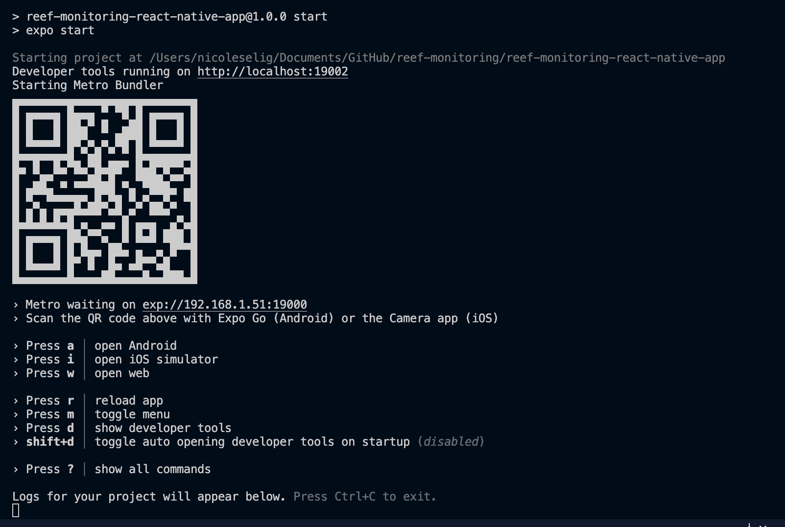

# Developer Setup

## Prerequisites
- [Visual Studio Code](https://code.visualstudio.com)
- [Android Studio](https://developer.android.com/studio)
- [XCode](https://developer.apple.com/xcode/) (Mac only)
- [Expo Go](https://expo.dev/client) (Android and/or IOS)
- [NodeJS](https://nodejs.org/en/)
- [watchman](https://facebook.github.io/watchman/docs/install.html)

This is a test change
### To install Expo run:
`npm install -g expo`

##  React Native App
You will need to install all of the dependencies   
`cd reef-monito-react-app`  
`npm i`

## Running the App
`npm start`  or `expo start`

You can run the developer tools in your browser on the local host. Simulators can be run from there, or scan the QR code with your chosen device.

